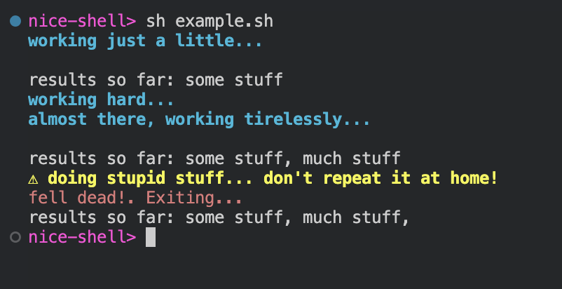

# Nice Shell

A project with a goal to make your shell experience nicer.

The fundament of the project is a few handy functions from the `.sh` file:

- `log` - prints a message in blue in `stderr` (not captured in the result)
- `ret` - sends a message to `stdout`, a new line to `stderr`, and exits successfully
- `throw` - prints a message in red in `stderr` and exits with error
- `warn` - prints a message in yellow with a warning sign to `stderr`

Those functions should be sourced. Here's a simple line to source the functions for the current shell:

```sh
source /dev/stdin <<< "$(curl -sS https://raw.githubusercontent.com/astorDev/nice-shell/refs/heads/main/.sh)"
```

And here's what the result of using those functions might look like:



Below you can check the script producing the result:

```sh
## Installing the script
source /dev/stdin <<< "$(curl -sS https://raw.githubusercontent.com/astorDev/nice-shell/refs/heads/main/.sh)"

do_light_work() {
    log "working just a little..."
    ret "some stuff"
}

do_hard_work() {
    log "working hard..."
    log "almost there, working tirelessly..."
    ret "much stuff"

    warn "Don't repeat at home! Oh, no one is listening..."
    throw "fell dead, but no one noticed"
}

do_stupid_work() {
    warn "doing stupid stuff... don't repeat it at home!"
    
    throw "fell dead!"
}

results=$(do_light_work)
echo "results so far: $results"
results+=', '
results+=$(do_hard_work)
echo "results so far: $results"
results+=', '
results+=$(do_stupid_work)
echo "results so far: $results"
```

