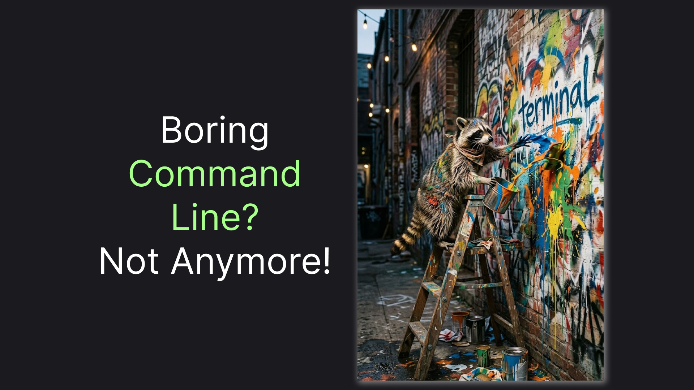
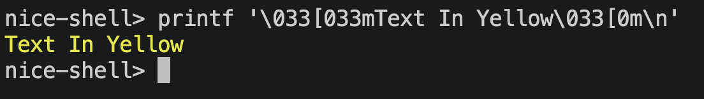
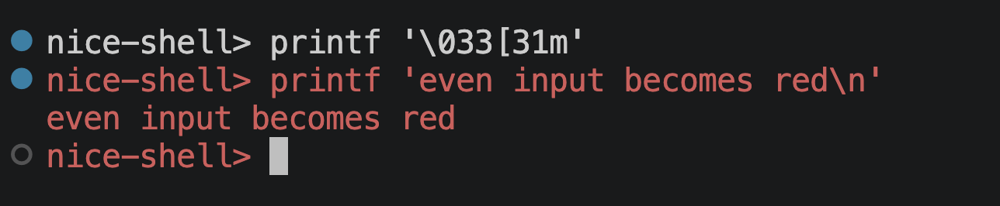
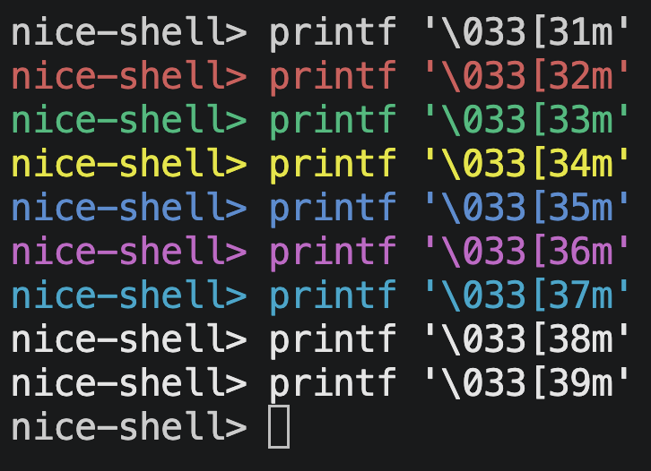
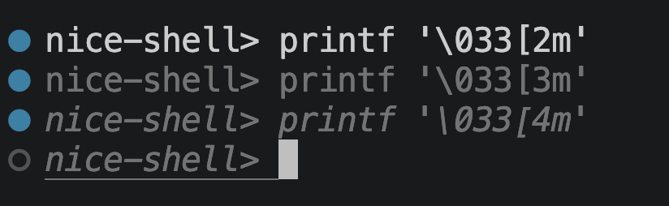
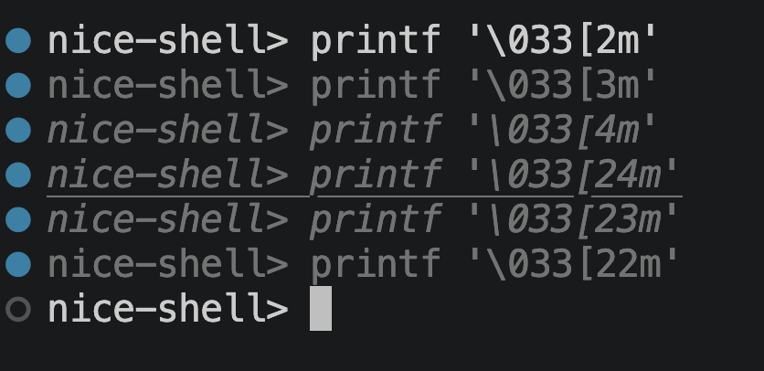
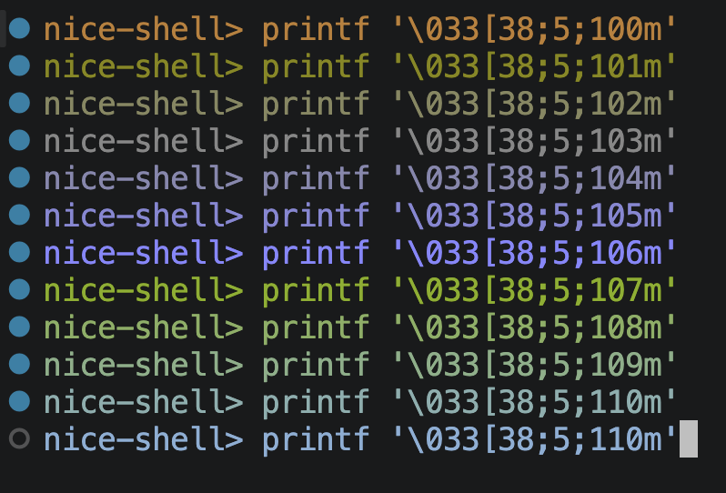
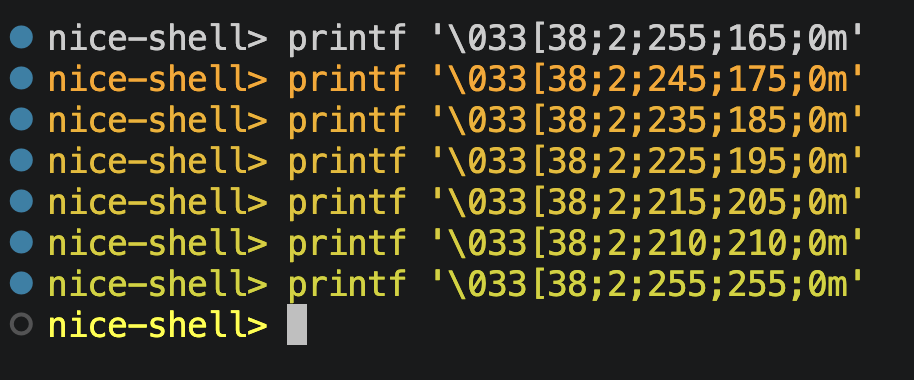

# How to Change the Colors of Your Terminal Output

> Colorize your console background, make text green, magenta, or even dimmed.



Since our first "Hello, World!" we programmers use the terminal (or console if you are on Windows). Sometimes, however, it takes years (took 8 in my case) to realize that command-line apps can be more than just black and white and that we can use it to make communication with CLI applications more enjoyable. 

Unfortunately, we can't just do something like `[green:Text in green]` and expect the text to be rendered accordingly. Today's colorization techniques date back to the late 70s, so as you might expect, they are relatively cryptic. They rely on so-called ANSI escape codes. In this article, we will demystify these codes a little and use them for various scenarios, from simple text colorization to background changes and dimming.

## Jump Start

Let's get straight to the chase and print something in color. Let's use the following command:

```sh
printf '\033[33mText In Yellow\033[0m\n'
```

> ⚠️ Windows users: The examples in this article use printf, a Unix/POSIX command that isn't available as the same command in native Windows shells such as cmd.exe or PowerShell. If you're on Windows, use Git Bash or WSL instead. The rest of the article assumes you're using a Unix-compatible shell.

If everything goes smoothly, you should see an output like this:



So what's just happened? 

We used `printf` to send input to the terminal. Notably, we also sent not just literal text, but also commands. We can roughly split our input into 4 parts:

- `\033[33m` - Command to set foreground color to yellow.
- `Text In Yellow` - Literal string. Could be anything; it doesn't have any effect on the presentation.
- `\033[0m` - Command to reset all "effects". Including foreground color changes.
- `\n` - Newline

On a fundamental level, this covers how to manipulate terminal colors. But you probably want more than only making text yellow, right? Let's go to the next session!

## What Colors Do We Have?

As you might have noticed, the only crucial part for coloring the text was the `\033[33m` part. In this section, we'll focus on this specifically on it. 

However, shells nowadays play with colors, too. Gladly, we can prevent this interference by configuring the so-called prompt string. We can do it for the current shell session by setting it to just the current folder name without any colorization:

```sh
PS1='\W> '
```

For example, we can ask the terminal to turn the foreground red:

```sh
printf '\033[31m'
```



Notice that all the text after the command becomes red, including the prompt string. That's because the commands affect the session terminal as a whole, not simply our current prompt.

To reset everything back to normal, we can always use:

```sh
printf '\033[0m'
```

We don't have many default colors left, though. Here's how we can see them all:

```sh
printf '\033[32m'
printf '\033[33m'
printf '\033[34m'
printf '\033[35m'
printf '\033[36m'
printf '\033[37m'
printf '\033[38m'
printf '\033[39m'
```

Which should show you an output like this:



Notice that only one number changes across colors. That number represents a command to manipulate a terminal rendering. We don't have many built-in colors, but fortunately, we can manipulate the background as well and also have bright variants of the built-in colors. 

Here's the command codes table for built-in colors:

| Color   | Foreground | Background | Bright Foreground | Bright Background |
| ------- | ---------: | ---------: | ----------------: | ----------------: |
| Black   |         30 |         40 |                90 |               100 |
| Red     |         31 |         41 |                91 |               101 |
| Green   |         32 |         42 |                92 |               102 |
| Yellow  |         33 |         43 |                93 |               103 |
| Blue    |         34 |         44 |                94 |               104 |
| Magenta |         35 |         45 |                95 |               105 |
| Cyan    |         36 |         46 |                96 |               106 |
| White   |         37 |         47 |                97 |               107 |

You can safely play around with it by just remembering that `\033[0m` will reset all the effects, not just the foreground. But if all we change is just the command color, why do we have such a long string? Let's find out in the next section.

## Why is `\033[33m` so Cryptic? Reason 1: ESC character.

One of the keys to understanding the string we have is to understand how many characters we do have. Of course, we **type** `\`, `0`, `3`, `3`, `[`, `m` - so 6 characters. However, [in the computer alphabet](https://medium.com/@vosarat1995/how-to-talk-in-1s-and-0s-e3d8a852a2b0) there are characters that are invisible to the human eye. To convey those characters to the computer, we use the escape symbol `\` and pass the number of the characters to the computer.

This includes the `ESC` character, which corresponds to the number `27`. However, `27` is a decimal number, which we humans think in. For some reason, we decided that we will convey character numbers in octal or in [hex](https://medium.com/@vosarat1995/binary-to-text-encoding-hex-03c8449ff08a).

In fact, we can send exactly the same characters to the computer using hex notation:

```sh
printf '\x1b[33mText In Yellow\x1b[0m\n'
```

Most shells will also recognize `\e` notation:

```sh
printf '\e[33mText In Yellow\e[0m\n'
```

Although `\e` might look the clearest, it is not as universally recognized as `\033` and `\x1b`, so the latter are preferred. So now we have 3 characters: `ESC`, `[` and `m`. But still, why so many?

## Why is `\033[33m` so Cryptic? Reason 2: Universal Command Sequence

I guess it's pretty understandable why `ESC` alone is not enough, since it has such a broad meaning. However, it's still unclear why we need `m` at the end. Why not just have `ESC` + `[` for example? The reason is that `ESC` + `[` is not limited to graphics. `m` is what says that the command is about rendering. In other words, we have the following functions of the symbols:

- `[` begins a command. In literature, it's called "Control Sequence Introducer" or CSI.
- `m` specifies the type of command to be color- and format-related. In literature, it's called Select Graphic Rendition or SGR.

There are quite a few other command types. For example, let's say we have the following text:

```sh
printf 'I want to disappear\n'
```

We can later actually send a terminal `J`-type command with `1` as a command code, which will clear the terminal:

```sh
printf '\x1b[1J'
```

You might've used the `clear` command, which makes your terminal fresh and clean. Interestingly, we can achieve the same result with two commands, using the `ESC + [ + Command + Command Type Letter` notation, which we familiarized ourselves with in this article:

```sh
printf '\033[2J\033[H'
```

You can easily find more examples on the web or by asking an AI, but today's article is about making your terminal look cool, and there are a couple more important concepts we need to cover.

## Advanced Commands: 1. Text Effects - Dimmed, Italic, Underlined

By now, we've already established that we can do "rendering" modifications beyond changing foreground. With probably the most important command being `0`:

- `0` Resets all the settings to default.

So we can always get a fresh start with:

```sh
printf '\033[0m'
```

We can also manipulate text representation with the following effects:

- `2` - dimmed
- `3` - italic
- `4` - underlined

So if we send those commands:

```sh
printf '\033[2m'
printf '\033[3m'
printf '\033[4m'
```

We should get something like this:



Notice that those effects stack on top of each other. `0` would cancel them altogether, but what if you just want to cancel specific ones? For this command, prepending `2` gets you a matching "cancelling" command:

- `2` - cancels dimmed
- `3` - cancels italic
- `4` - cancels underlined

Here's how it looks:



There's nothing new about these commands in principle, but it's just nice to know what you can do. With the next set of commands, however, things get a little more complicated.

# Advanced Commands: Parameterization - 255, RGB

So far, we've only seen simple commands: one number - one action. But what if we want to have arguments for even subcommands? There's a solution for that! In fact, if we want to access the full range of RGB colors, we would need both. The master command is `38` and here's how it works:

- `38` - Set custom foreground colors. Has 2 modes:
  - `38;5` - 255 range. Next number: the color
  - `38;2` - RGB. Next 3 numbers: red;green;blue

To see that in practice, let's start with the 255 range, since it's a little shorter:

```sh
printf '\033[38;5;100m'
printf '\033[38;5;101m'
printf '\033[38;5;102m'
printf '\033[38;5;103m'
printf '\033[38;5;104m'
printf '\033[38;5;105m'
printf '\033[38;5;106m'
printf '\033[38;5;107m'
printf '\033[38;5;108m'
printf '\033[38;5;109m'
printf '\033[38;5;110m'
```

Going through colors in the 100-110 range should give us something like this:



But the 255 range is pretty hard to guess from the numbers, with RGB we can do something fancier, by going from orange which is RED and GREEN mixture with RED dominating at 255, to yellow, which is balanced RED and GREEN:

```sh
printf '\033[38;2;255;165;0m'
printf '\033[38;2;245;175;0m'
printf '\033[38;2;235;185;0m'
printf '\033[38;2;225;195;0m'
printf '\033[38;2;215;205;0m'
printf '\033[38;2;210;210;0m'
printf '\033[38;2;255;255;0m'
```

If everything works, you should see a nice gradient like this:



The article doesn't cover every possible command, of course. Still, it should give you a nice overview of all the important categories of commands from which you can create almost any visual representation you wish. Let's conclude!

## TL;DR

In this article, we've seen how and why we can use different code with `printf '\033[<COMMANDS>m'` to change the appearance of the next things that are printed to our terminal. From built-in colors within the 30-37 range to underscore and RGBs, we've taken a look at commands of various complexity and versatility.

This article is part of the [nice-shell repository](https://github.com/astorDev/nice-shell), trying to help your shell experience be nicer. Click on the [github link](https://github.com/astorDev/nice-shell) to see other goodies it has to offer, and don't hesitate to give the repository a star! ⭐

Claps for this article are also appreciated! 😊
