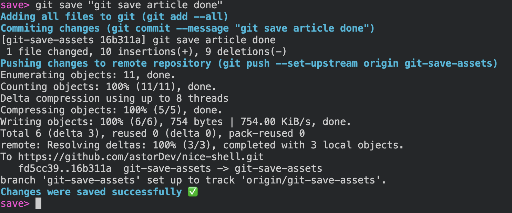

# Custom Git Command I Use All The Time!

> Using Git Aliases To Simplify Saving Your Changes

[Makes Git 1.47x Times Nicer!](thumb.png)

Git is awesome, but Git could be cumbersome, as well. It seems like Git developers are well aware of that problem; that's why they introduced a feature called Git Aliases. In this article, I'm going to introduce you to Git Aliases and guide you on how to create the one I use virtually every day!

> If you just want a quick script for adding the command, jump straight to the [TLDR](#tldr) at the end of this article.

## What is Git Alias?

Git Aliases are a way to extend `git` command line utils with new commands, perhaps giving an old command a shorter or clearer name. 

```sh
git config --global alias.last 'log -1 HEAD'
```

`~/.gitconfig`

```toml
[alias]
	last = log -1 HEAD
```

Looking like this:

```text
commit 297625e0522f5488f7f923d6a1ece4c4f8ebdab8 (HEAD -> git-save-assets, origin/git-save-assets)
Author: Egor Tarasov <vosarat1995@google.com>
Date:   Thu May 15 22:05:48 2025 +0300

    git save article
```

## Making a More Complex Alias

`!` symbol

```sh
git config --global alias.hello '!echo "Hello From Git Alias"'
```

```sh
git config --global alias.check '!if [ -z "$1" ]; then echo "No arg"; else echo "Arg: $1"; fi'
```

`git check one` 

```text
if [ -z "$1" ]; then echo "No arg"; else echo "Arg: $1"; fi: -c: line 0: syntax error near unexpected token `"$@"'
if [ -z "$1" ]; then echo "No arg"; else echo "Arg: $1"; fi: -c: line 0: `if [ -z "$1" ]; then echo "No arg"; else echo "Arg: $1"; fi "$@"'
```

`syntax error near unexpected token "$@`

`f() { ... }; f`:

```sh
git config --global alias.check '!f() { if [ -z "$1" ]; then echo "No arg"; else echo "Arg: $1"; fi; }; f'
```

```text
Arg: one
```

## Getting Current Branch Name with `current` Alias

```sh
git config --global alias.current 'rev-parse --abbrev-ref HEAD'
```

```sh
git config --global alias.echo-current '!echo "📌 Current Git Branch: $(git current)"'
```

## Making The Alias. Solving The Verbosity Of Fully Saving Changes 

1. Add Changes to Git
2. Commit The Changes
3. Push the Changes, Creating a Remote Branch

```sh
git add -A
git commit -m "$1"
CURRENT_BRANCH=$(git rev-parse --abbrev-ref HEAD)
git push  --set-upstream origin $CURRENT_BRANCH"
```

## Improving Transparency with Nice-Shell

```sh
source /dev/stdin <<< "$(curl -sS https://raw.githubusercontent.com/astorDev/nice-shell/refs/heads/main/.sh)"

if [ -z "$1" ]; then
    throw "Commit message was not provided"
fi

log "Adding all files to git (git add -A)"
git add -A

log "Commiting changes (git commit -m \"${1}\")"
git commit -m "$1"

CURRENT_BRANCH=$(git rev-parse --abbrev-ref HEAD)
log "Current branch: $CURRENT_BRANCH"

log "Pushing changes to remote repository (git push --set-upstream origin $CURRENT_BRANCH)"

git push  --set-upstream origin $CURRENT_BRANCH"
```

```sh
git config --global alias.save '!f() { \
    source /dev/stdin <<< "$(curl -sS https://raw.githubusercontent.com/astorDev/nice-shell/refs/heads/main/.sh)" && \
    if [ -z "$1" ]; then \
        throw "Commit message was not provided"; \
    fi && \
    log "Adding all files to git (git add -A)" && \
    git add -A && \
    log "Commiting changes (git commit -m \"${1}\")" && \
    git commit -m "$1" && \
    log "Pushing changes to remote repository (git push --set-upstream origin $(git current))" && \
    git push --set-upstream origin $(git current); \
}; f'
```

## TLDR;

In this article, we've created a git alias called `save`. It allows us to add, commit, and push changes using just one command. Instead of recreating it, you can install it straight from GitHub, with this one-liner:

```sh
curl -sS https://raw.githubusercontent.com/astorDev/nice-shell/main/git/save/install.sh | sh
```

After you see "✅ Installed `git save` alias", you will be able to use the alias like this:



The script, as well as this article, are parts of the [nice-shell repository](https://github.com/astorDev/nice-shell), trying to help your shell experience be nicer. Don't hesitate to give the repository a star! ⭐

Claps for this article are also appreciated! 😊
