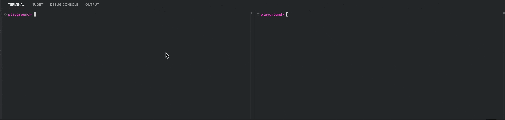
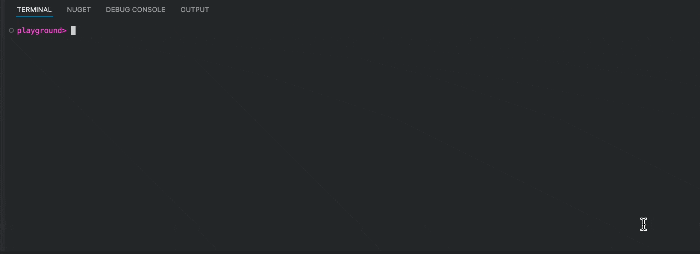
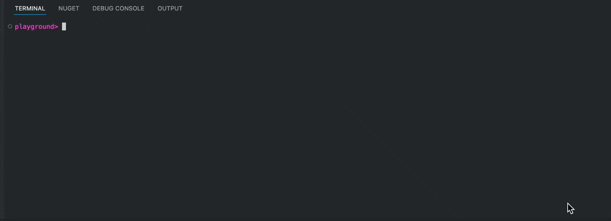

# Makefile: A Comprehensive Guide with Examples for .NET and Beyond

> Learn `make` util with a practical example of C# project with Docker.

Not that far ago, I've learned about the `make` utility and the `Makefile`. Although that util is very old by computer science standard (1977), it is still extremely helpful today in 2025! In this article, I want to share with you my findings about this utility and give you an example of how to use it with a modern project

The util was originally designed to help with compiling and building C projects, but the way it was built allows it to be useful for roughly any programming language there is. In this article, we will play around with a .NET project and Docker, but I believe you will still be able to grasp an overall idea regardless of the programming language you are using.

## Preparing the Project and Writing Our First Command (Recipe)

```sh
dotnet new web --name Playground
```

```csharp
builder.Logging.AddSimpleConsole(c => c.SingleLine = true);
```

```csharp
app.MapGet("/", () => new {
    message = "Hello World!"
});
```

`Program.cs`:

```csharp
var builder = WebApplication.CreateBuilder(args);

builder.Logging.AddSimpleConsole(c => c.SingleLine = true);

var app = builder.Build();

app.MapGet("/", () => new {
    message = "Hello World!"
});

app.Run();
```

`Makefile`:

```makefile
run:
	dotnet run
```

## Exploring the Power of Makefile: Adding `curl` Command

**centralized**

```makefile
curl:
	curl http://localhost:5154
```

`make run` and `make curl`



> It's generally considered a better practice to call another make command via `$(MAKE)`. But since for our case the benefits of `$(MAKE)` are not applicable we will keep it simple

```makefile
rurl-naive:
	make run & sleep 4 && make curl && fg
```

`make rurl-naive`



```text
/bin/sh: line 0: fg: no job control
```

```makefile
kill:
	kill `lsof -t -i:5154`
```

`make kill`:



## Fixing our `rurl` Command: Making it Work with Job Control

`bash -c -i`

```makefile
rurl:
	bash -c -i 'make run & sleep 2 && make curl && fg'
```


## Using Httpyac to Make It Beautiful

[article](https://medium.com/@vosarat1995/best-postman-alternative-5890e3e9ddc7) [Install the httpyac CLI](https://httpyac.github.io/guide/installation_cli).

`.http`:

```http
GET http://localhost:5154/
```

```makefile
yac:
	httpyac send .http --all
```


```makefile
play:
	bash -c -i 'make run & sleep 2 && make yac && fg'
```

`make play`


## Wrapping Up!

[nice-shell repository](https://github.com/astorDev/nice-shell)